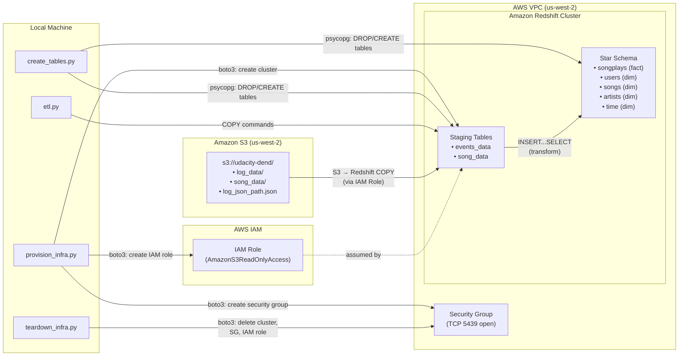

# Redshift ETL Project

```mermaid
graph LR
    subgraph "Local Machine"
        A["provision_infra.py"] 
        B["create_tables.py"]
        C["etl.py"]
        D["teardown_infra.py"]
    end
subgraph "AWS IAM"
    E["IAM Role\n(AmazonS3ReadOnlyAccess)"]
end
subgraph "AWS VPC (us-west-2)"
    F["Security Group\n(TCP 5439 open)"]
    subgraph "Amazon Redshift Cluster"
        G["Staging Tables\n• events_data\n• song_data"]
        H["Star Schema\n• songplays (fact)\n• users (dim)\n• songs (dim)\n• artists (dim)\n• time (dim)"]
    end
end
subgraph "Amazon S3 (us-west-2)"
    I["s3://udacity-dend/\n• log_data/\n• song_data/\n• log_json_path.json"]
end
A -- "boto3: create IAM role" --> E
A -- "boto3: create security group" --> F
A -- "boto3: create cluster" --> G
B -- "psycopg: DROP/CREATE tables" --> G
B -- "psycopg: DROP/CREATE tables" --> H
C -- "COPY commands" --> G
I -- "S3 → Redshift COPY\n(via IAM Role)" --> G
G -- "INSERT...SELECT\n(transform)" --> H
D -- "boto3: delete cluster,\nSG, IAM role" --> F
E -. "assumed by" .-> G
```
