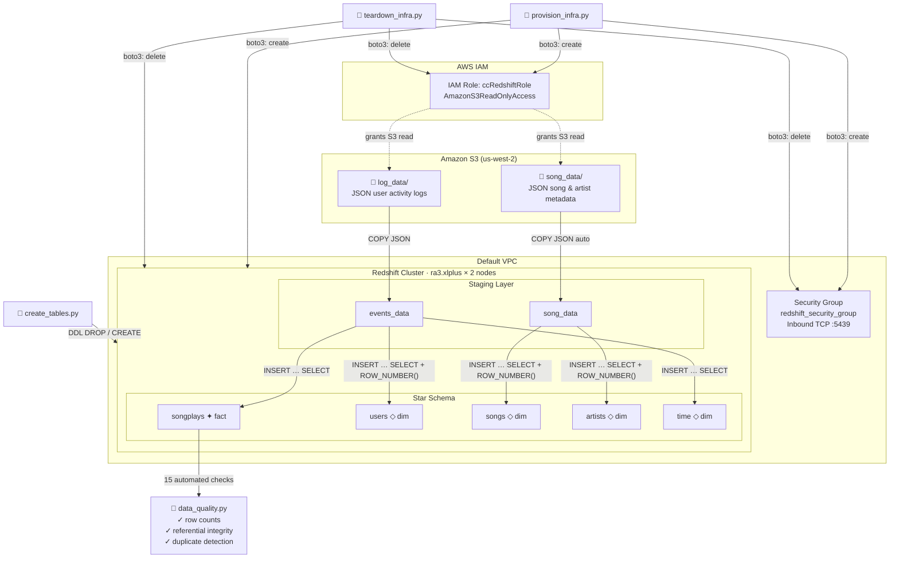

# Sparkify: S3-to-Redshift Data Warehouse ETL


---

## Table of Contents

1. [Project Overview](#project-overview)
2. [Architecture](#architecture)
3. [Data Model](#data-model)
4. [Project Structure](#project-structure)
5. [Tech Stack](#tech-stack)
6. [Prerequisites](#prerequisites)
7. [Setup & Usage](#setup--usage)
8. [ETL Pipeline](#etl-pipeline)
9. [Data Quality Checks](#data-quality-checks)
10. [Design Decisions](#design-decisions)
11. [Lessons Learned & Challenges](#lessons-learned--challenges)
12. [Future Improvements](#future-improvements)
13. [License](#license)
14. [Author](#author)

---

## Project Overview

Sparkify is a fast-growing music streaming startup whose user base and song catalogue have expanded to the point where their existing on-premises processes can no longer keep up. All of their data — JSON logs of user listening sessions and JSON metadata describing their song library — already lives in Amazon S3, and their analytics team needs a reliable, query-optimised data warehouse to answer questions like *"Which songs are our users listening to the most?"* and *"How does engagement differ between free and paid subscribers?"*

As their data engineer, you are tasked with building a cloud-native ETL pipeline that extracts that raw data from S3, stages it in Amazon Redshift, and transforms it into a clean **star schema** designed for fast analytical queries. The result is a data warehouse that empowers Sparkify's analysts to slice listening behaviour by song, artist, user, subscription tier, or any time dimension — all without writing complex joins against raw log files.

This project delivers:

- **Infrastructure-as-code** using Python and boto3 to provision and tear down every AWS resource required (IAM roles, VPC security groups, and a multi-node Redshift cluster) in a fully idempotent, repeatable way.
- **A staging layer** that bulk-loads raw JSON from S3 into Redshift via the `COPY` command — the fastest available ingestion path.
- **A star schema transformation layer** that joins, deduplicates, and type-casts the staged data into a fact table (`songplays`) and four dimension tables (`users`, `songs`, `artists`, `time`).
- **Automated data quality validation** with 15 checks covering row counts, referential integrity, and primary-key uniqueness, raising an exception immediately if any check fails.

---

## Architecture



---

## Data Model

The warehouse uses a **star schema** — a central fact table surrounded by denormalised dimension tables. This design minimises the number of joins needed for typical analytical queries and allows Redshift's query planner to use columnar compression and distribution-aware execution plans effectively.

### Staging Tables

| Table | Source | Description |
|---|---|---|
| `events_data` | `s3://udacity-dend/log_data` | Raw user activity log events (one row per app action) |
| `song_data` | `s3://udacity-dend/song_data` | Raw song and artist metadata |

### Star Schema

| Table | Type | Distribution | Sort Key | Key Columns |
|---|---|---|---|---|
| `songplays` | Fact | `DISTKEY(user_id)` | `start_time` | `songplay_id` (PK), `start_time`, `user_id`, `level`, `song_id`, `artist_id`, `session_id`, `location`, `user_agent` |
| `users` | Dimension | `DISTKEY(user_id)` | `user_id` | `user_id` (PK), `first_name`, `last_name`, `gender`, `level` |
| `songs` | Dimension | `DISTSTYLE ALL` | `song_id` | `song_id` (PK), `title`, `artist_id`, `year`, `duration` |
| `artists` | Dimension | `DISTSTYLE ALL` | `artist_id` | `artist_id` (PK), `name`, `location`, `latitude`, `longitude` |
| `time` | Dimension | `DISTSTYLE ALL` | `start_time` | `start_time` (PK), `hour`, `day`, `week`, `month`, `year`, `weekday` |

**Entity-Relationship Summary:**

```
songplays ──< users      (user_id)
songplays ──< songs      (song_id)
songplays ──< artists    (artist_id)
songplays ──< time       (start_time)
songs     ──< artists    (artist_id)
```

---

## Project Structure

```
udacity-data-eng-aws-redshift-data-warehouse-etl/
├── dwh.cfg                        # Active config (git-ignored — contains secrets)
├── dwh.cfg.example                # Template — copy to dwh.cfg and fill in values
├── pyproject.toml                 # Project metadata, dependencies (uv / hatchling)
├── LICENSE
├── README.md
├── notebooks/
│   └── analytics_dashboard.ipynb  # Exploratory analysis & visualisations
└── src/
    └── redshift_etl/
        ├── __init__.py
        ├── create_tables.py        # Drops and recreates all tables
        ├── etl.py                  # Orchestrates COPY → INSERT → quality checks
        ├── scripts/
        │   ├── config_helper.py    # ConfigParser helpers (preserves key casing)
        │   ├── provision_infra.py  # boto3: create IAM role, SG, Redshift cluster
        │   └── teardown_infra.py   # boto3: delete IAM role, SG, Redshift cluster
        └── sql/
            ├── sql_queries.py      # DDL, COPY commands, INSERT…SELECT statements
            └── data_quality.py     # 15 data-quality check definitions
```

---

## Tech Stack

| Layer | Technology | Version |
|---|---|---|
| Language | Python | ≥ 3.14 |
| AWS SDK | boto3 | ≥ 1.42.59 |
| Database driver | psycopg (v3, binary) | ≥ 3.3.3 |
| Cloud warehouse | Amazon Redshift | ra3.xlplus |
| Raw storage | Amazon S3 | — |
| Identity & access | AWS IAM | — |
| Package manager | [uv](https://docs.astral.sh/uv/) | — |
| Build backend | hatchling | — |
| Notebook analysis | Jupyter, pandas, matplotlib, seaborn | — |

---

## Prerequisites

- **AWS account** with permissions to create IAM roles, EC2 security groups, and Redshift clusters.
- **AWS access key** (Key ID + Secret) stored in `dwh.cfg` (never committed to source control, copy `dwh.cfg.example`).
- **Python ≥ 3.14** and **uv** installed locally.
  ```bash
  # Install uv (macOS / Linux)
  curl -LsSf https://astral.sh/uv/install.sh | sh
  ```
- The Redshift cluster must be in **us-west-2** (the Udacity S3 buckets are in that region).

---

## Setup & Usage

### 1. Clone and install dependencies

```bash
git clone https://github.com/Cadyshack/udacity-data-eng-aws-redshift-data-warehouse-etl.git
cd udacity-data-eng-aws-redshift-data-warehouse-etl

uv sync          # creates .venv and installs all dependencies
uv sync --group dev  # also installs Jupyter, pandas, matplotlib, seaborn, ipykernel
```

### 2. Configure credentials

```bash
cp dwh.cfg.example dwh.cfg
```

Open `dwh.cfg` and fill in your values:

```ini
[AWS]
KEY    = <your-aws-access-key-id>
SECRET = <your-aws-secret-access-key>

[CLUSTER]
DB_PASSWORD = <choose-a-strong-password>
; HOST, ROLE_ARN and SG_ID are auto-populated by provision_infra.py
```

> **Security note:** `dwh.cfg` is git-ignored. Never commit AWS credentials to source control.

### 3. Provision AWS infrastructure

```bash
uv run python -m redshift_etl.scripts.provision_infra
```


This creates (idempotently):
- IAM role `ccRedshiftRole` with `AmazonS3ReadOnlyAccess`
- VPC security group `redshift_security_group` (inbound TCP 5439)
- Redshift cluster `cc-redshift-cluster` (`ra3.xlplus`, 2 nodes)

The cluster endpoint and resource IDs are automatically written back to `dwh.cfg`.

> Provisioning the cluster takes approximately 5–10 minutes. The script uses boto3 waiters to block until the cluster is fully available before returning.

### 4. Create tables

```bash
uv run python -m redshift_etl.create_tables
```

Drops all existing tables and recreates the staging layer and star schema with the correct DDL (distribution styles, sort keys, foreign-key constraints).

### 5. Run the ETL pipeline

```bash
uv run python -m redshift_etl.etl
```


This performs three sequential phases:

1. **Stage** — `COPY` JSON data from S3 into `events_data` and `song_data`.
2. **Transform** — `INSERT … SELECT` from staging tables into the star schema.
3. **Validate** — Run 15 automated data quality checks; raises `ValueError` on any failure.

### 6. Explore the data (optional)

```bash
uv run jupyter lab notebooks/analytics_dashboard.ipynb
```

### 7. Tear down infrastructure

```bash
uv run python -m redshift_etl.scripts.teardown_infra
```


Deletes the Redshift cluster, security group, and IAM role in order, and clears the auto-populated fields in `dwh.cfg`. Safe to run even if some resources have already been deleted.

---

## ETL Pipeline

```
S3 (log_data, song_data)
        │
        │  Phase 1 — STAGE
        │  COPY … FORMAT AS JSON
        ▼
  Redshift Staging Tables
  (events_data, song_data)
        │
        │  Phase 2 — TRANSFORM
        │  INSERT … SELECT + ROW_NUMBER() deduplication
        ▼
  Star Schema
  (songplays, users, songs, artists, time)
        │
        │  Phase 3 — VALIDATE
        │  15 automated checks
        ▼
  ✅  Pipeline complete  (or ❌ ValueError on failure)
```

### Phase 1 — Staging

Two `COPY` commands ingest the raw data:

```sql
-- User activity logs (uses explicit JSON path file for field mapping)
COPY events_data FROM 's3://udacity-dend/log_data'
CREDENTIALS 'aws_iam_role=<role_arn>'
FORMAT AS JSON 's3://udacity-dend/log_json_path.json'
region 'us-west-2';

-- Song metadata (auto-maps JSON keys to column names)
COPY song_data FROM 's3://udacity-dend/song_data'
CREDENTIALS 'aws_iam_role=<role_arn>'
FORMAT AS JSON 'auto'
region 'us-west-2';
```

### Phase 2 — Transform

Each dimension table is populated with `ROW_NUMBER()` deduplication before the fact table is loaded:

```sql
-- Example: latest user record wins (ordered by ts DESC)
INSERT INTO users (user_id, first_name, last_name, gender, level)
SELECT user_id, first_name, last_name, gender, level
FROM (
    SELECT userId AS user_id, firstName AS first_name, lastName AS last_name,
           gender, level,
           ROW_NUMBER() OVER (PARTITION BY userId ORDER BY ts DESC) AS row_num
    FROM events_data
    WHERE userId IS NOT NULL AND page = 'NextSong'
)
WHERE row_num = 1;
```

The `songplays` fact table joins `events_data` with `song_data` on song title, artist name, and track duration to resolve `song_id` and `artist_id`:

```sql
INSERT INTO songplays (start_time, user_id, level, song_id, artist_id, ...)
SELECT DISTINCT TIMESTAMP 'epoch' + ed.ts/1000 * INTERVAL '1 second',
       ed.userId, ed.level, sd.song_id, sd.artist_id, ...
FROM events_data AS ed
LEFT JOIN song_data AS sd
    ON ed.song = sd.title AND ed.artist = sd.artist_name AND ed.length = sd.duration
WHERE ed.page = 'NextSong';
```

---

## Data Quality Checks

After the ETL load, 15 automated checks are run across three categories. Any failure raises a `ValueError` immediately, making pipeline failures impossible to miss.

| Category | # Checks | What is verified |
|---|---|---|
| **A. Row counts** | 5 | Every table (`songplays`, `users`, `songs`, `artists`, `time`) contains at least one row |
| **B. Referential integrity** | 5 | Every FK in `songplays` resolves to a row in the referenced dimension; every `songs.artist_id` resolves to `artists` |
| **C. Duplicate primary keys** | 5 | No duplicate PKs in any of the five tables |

### Check Definitions

| # | Description | Category |
|---|---|---|
| 1 | `songplays` table has rows | Row count |
| 2 | `users` table has rows | Row count |
| 3 | `songs` table has rows | Row count |
| 4 | `artists` table has rows | Row count |
| 5 | `time` table has rows | Row count |
| 6 | All `songplays.user_id` exist in `users` | Referential integrity |
| 7 | All non-null `songplays.song_id` exist in `songs` | Referential integrity |
| 8 | All non-null `songplays.artist_id` exist in `artists` | Referential integrity |
| 9 | All `songplays.start_time` exist in `time` | Referential integrity |
| 10 | All `songs.artist_id` exist in `artists` | Referential integrity |
| 11 | No duplicate `user_id` in `users` | Duplicate detection |
| 12 | No duplicate `song_id` in `songs` | Duplicate detection |
| 13 | No duplicate `artist_id` in `artists` | Duplicate detection |
| 14 | No duplicate `start_time` in `time` | Duplicate detection |
| 15 | No duplicate `songplay_id` in `songplays` | Duplicate detection |

---

## Design Decisions

### psycopg v3 with `client_encoding='utf8'`

Redshift reports its server-side encoding as `'UNICODE'`, which is not a valid codec name in Python's codec registry. psycopg v3 queries the server encoding at connection time and attempts to look it up — this raises `LookupError: unknown encoding: 'UNICODE'` unless overridden. Setting `client_encoding='utf8'` explicitly at connection time bypasses the lookup and works correctly for all Sparkify log and song data.

### `DISTSTYLE ALL` for dimension tables

`songs`, `artists`, and `time` are relatively small tables that are joined by many queries. Distributing them to **every node** (`DISTSTYLE ALL`) means Redshift never has to shuffle dimension rows across the network during a join — the local copy is always available. The storage overhead is worthwhile given the query performance benefit.

### `DISTKEY(user_id)` on `songplays` and `users`

The most common analytical join is `songplays ↔ users`. By using `user_id` as the distribution key for both tables, Redshift co-locates matching rows on the same node slice, eliminating cross-node data movement for that join. `user_id` was chosen over `song_id` or `artist_id` because user-behaviour queries (e.g. "what did user X listen to?") are the primary analytical use-case.

### `ROW_NUMBER()` for deduplication

The source data in S3 can contain multiple rows for the same user, song, or artist (e.g. a user who upgraded from free to paid tier, or a song that appears in multiple log events). Using `ROW_NUMBER() OVER (PARTITION BY <pk> ORDER BY <recency>)` inside a subquery, and then filtering to `row_num = 1`, produces a deterministic single winner per primary key entirely within SQL — no application-side deduplication loop is needed and the logic is transparent and auditable.

### Idempotent provisioning and teardown

Both `provision_infra.py` and `teardown_infra.py` handle "already exists" or "does not exist" errors as non-fatal, continuing to the next step. This means:

- Re-running `provision_infra.py` after a partial failure (e.g. cluster creation timed out) picks up where it left off without leaving orphaned resources.
- Re-running `teardown_infra.py` after a partial teardown is safe and completes the cleanup.
- The cluster endpoint and resource IDs are written back to `dwh.cfg` automatically, so subsequent scripts always have current connection details.

---

## Lessons Learned & Challenges

**table references need to be considered.** When the `create_table.py` script runs, it gave multiple errors at first since I added foreign key constraints (`sql_queries.py`) in my tables via the `CREATE TABLE` commands, which are saved in the `create_table_queries` list. Although Redshift allows you to define FOREIGN KEY and PRIMARY KEY constraints, they are not enforced and are only for information purposes. Yet, upon table creation, if you create a table that has a reference to another table before it's created, it causes an error. Therefore table creation sequence needs to keep these references in mind.

**psycopg v2 → v3 encoding behaviour change.** psycopg v2 silently ignored unknown server encodings; v3 is stricter and raises an error. The `client_encoding='utf8'` workaround was discovered by reading the psycopg changelog and Redshift driver notes, and required understanding the difference between server-reported encoding names and Python codec names.

**Idempotency requires explicit error-code handling.** boto3 `ClientError` exceptions carry an error code in the response metadata (e.g. `EntityAlreadyExists`, `InvalidGroup.Duplicate`). Writing robust idempotent infrastructure code means catching and inspecting those codes precisely — catching a bare `Exception` would hide real failures.

**COPY performance vs. INSERT row-by-row.** Attempting to insert rows individually with a Python loop is orders of magnitude slower than a single `COPY` command. Redshift's `COPY` is purpose-built for bulk load from S3 and should always be preferred for staging.

**JOIN matching on three columns.** The song-to-event join (`ON title AND artist_name AND duration`) is deliberately strict to minimise false-positive matches between songs with similar names. Looser matching (e.g. title only) would inflate `songplay` counts with incorrect `song_id` values.

**boto3 waiters for long-running operations.** Creating and deleting a Redshift cluster is asynchronous and can take 5–10 minutes. Using `get_waiter('cluster_available').wait(...)` instead of a manual polling loop delegates the retry/backoff logic to boto3 and produces clean, readable provisioning code.

---

## Future Improvements

- **Migrate IaC to Terraform** - boto3 should never be used for provisioning resources in AWS, only for connecting to these resources programatically. A better choise would be to use terraform for resource management, but given the ephemeral nature of this project, and limitations on handing in such a project, combined with the need to showcase and practice the use of boto3, it was best to stick with boto3 for this specific project. Any production code would need to use either terraform or CloudFormation for Infrastructure as Code.
- **Apache Airflow DAG** — Schedule and monitor the pipeline with automatic retries, SLA alerts, and a visual dependency graph.
- **Incremental loads** — Track a high-water mark (e.g. maximum `ts` processed) to load only new log events instead of re-staging everything on each run.
- **Parameterise the region** — Move `us-west-2` out of hard-coded strings and into `dwh.cfg` so the project can target any AWS region.
- **Secrets Manager integration** — Replace plaintext credentials in `dwh.cfg` with AWS Secrets Manager lookups to harden the security posture.
- **dbt transformations** — Replace the raw SQL `INSERT … SELECT` statements with dbt models to gain lineage tracking, documentation generation, and incremental materialisation.
- **CI/CD pipeline** — Add a GitHub Actions workflow that lints, unit-tests, and dry-runs the infrastructure code on every pull request.
- **Extended data quality** — Add checks for NULL rates on key columns, value-range assertions (e.g. `year BETWEEN 1900 AND 2030`), and freshness checks.

---

## License

This project is licensed under the MIT License — see [LICENSE](LICENSE) for details.

---

## Author

**Christian Cadieux**

Built as part of the [Udacity Data Engineering Nanodegree](https://www.udacity.com/course/data-engineering-nanodegree--nd027) program.

